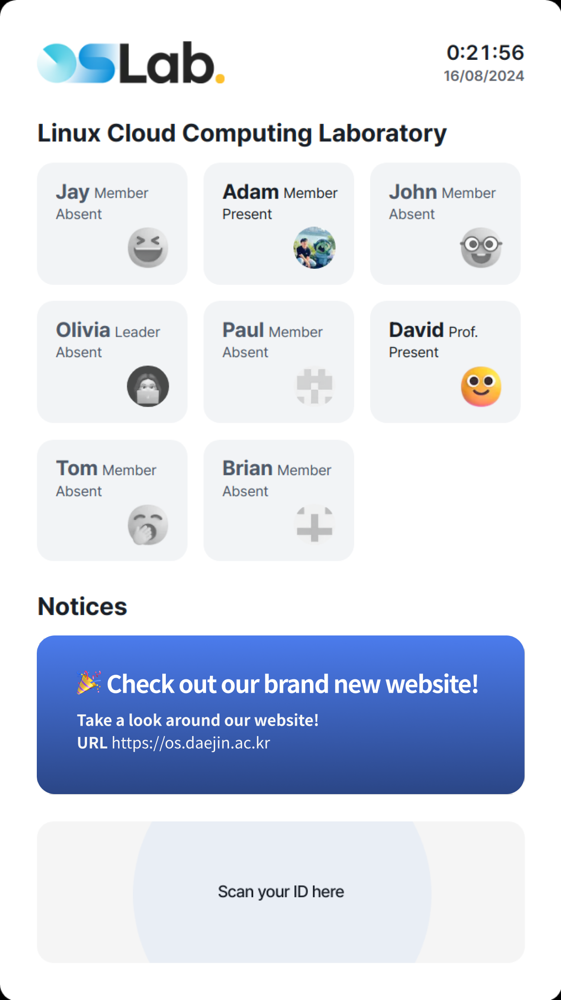
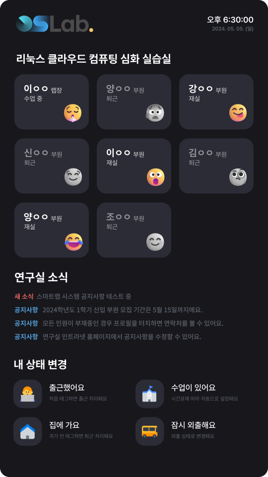

Project SmartLab
===

📌 개요
---
스마트랩 프로젝트는 대진대학교 OS 연구실 내 환경을 자동화하는 프로젝트입니다.

📌 구성요소 소개
---
스마트랩 시스템은 크게 다음 요소로 구성됩니다.

1. 월패드
> 연구실 외부에 설치되는 모니터로, 부원 재실 현황과 연구실 소식 등의 간단한 정보를 표시합니다.
> Next.js를 사용하여 프론트엔드 화면을 구현하고, 스마트카드 처리를 위해 Node.js와 Socket.IO를 백엔드에서 활용하였습니다. 
2. 스마트카드
> JavaCard 3.0.5 기반의 스마트카드로, 이름과 학번 등 부원의 고유 정보가 저장합니다. 
> 자체적인 Challenge-Response 방식의 인증 로직을 구현하여 출퇴근시 월패드에 태그하는 방식으로 사용할 수 있으며, 
> 부원 전용 웹서비스에서 2차 인증을 하는 데에도 사용할 수 있습니다. 
3. 서버
> 월패드가 전송하는 각종 로그를 전달받아 저장하고, IoT 허브로 기능하여 월패드가 전송하는 장치(도어락, 조명)제어 요청을 받고 실제 장치 제어를 담당합니다. 
 

📌 기타
---

1. 연구실 전용 앱
> 사용 중인 스마트폰에 스마트카드를 접촉하여 저장된 출퇴근 기록을 확인할 수 있습니다. 
> 부가기능으로 첫 출근 시 도어락 해제, 마지막 퇴근 시 조명 끄기와 같이 개인 맞춤 설정값을 변경할 수 있는 기능을 제공합니다. 
> 스마트카드를 휴대폰에 태그하여 웹에서 2FA 인증을 할 수 있는 기능을 제공합니다.
 

📌 적용한 기술
---

|Component|Used tech.(language)|Directory|
|------|------|-----|
|월패드(프론트엔드)|Next.js (JavaScript)|wallpad-frontend|
|월패드(백엔드)|Node.js (JavaScript)|wallpad-backend|
|Database|SQLite|
|스마트카드|JavaCard 3.0.5 (Java)|smartcard|
|서버|미정||
|전용 앱|Flutter (Dart)||
